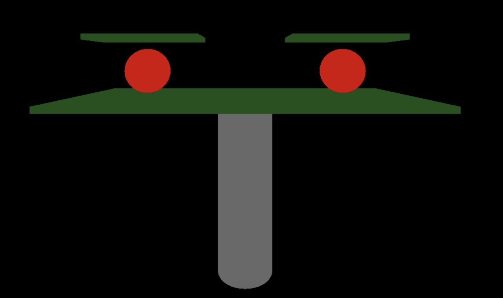
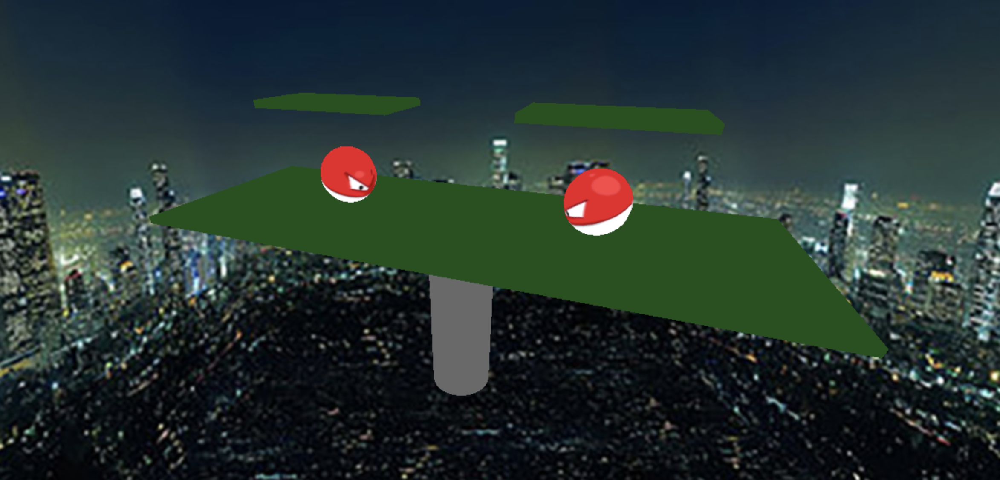

# Proyecto Final - WebGL

Proyecto final de la clase TC3022 - Gráficas computacionales. Creación de una escena en 3D utilizando WebGL.

**CÓDIGO EN SRC > INDEX.TS**

## Avance 1
##### *Miércoles 11 de Noviembre 2020*

Para esta escena, se realizará un campo de batalla de Pokémon, más específicamente uno parecido al de Pokémon Stadium utilizado en los juegos de Super Smash Bros. Este consiste de una superficie plana como base y dos plataformas flotando en el aire. Cada superficie plana tendrá su textura para hacerla similar a la del videojuego. Contará con una columna cilíndrica debajo que "sostiene" al campo de batalla. Habrán dos Pokémon en la escena, estos tendrán cuerpos fáciles de modelar o sin tantos detalles para poder aplicarles las texturas sin problemas. Uno de ellos podrá ser controlable para simular que pueda "atacar" al otro con Placaje (moverse hacia la dirección del otro Pokémon). Las figuras estarán conformadas por formas primitivas para producir las plataformas, columna y pokémon incluidos.


Ejemplo del campo de batalla de la escena:


## Avance 2
##### *Miércoles 18 de Noviembre 2020*

Se desarrollaron las geometrías principales que se utilizarán como base o esqueleto de toda la escena. Estás incluyen: una base de prisma rectangular, dos plataformas de prismas rectangulares, dos esferas y un cilindro como pilar.

Se integraron **three.js** para realizar las geometrías y **Snowpack** para crear el build y poder utilizarlo en un browser de manera más automática al mostrar los cambios en tiempo real. Se cambió al uso de **Typescript** (superset de JavaScript).

La forma de lanzarlo es la siguiente

**Instalación de npm**

```
npm install
```

**Instalación de Snowpack**

```
npm install --save-dev snowpack
```

**Iniciar el proyecto**
```
npm start
```

El proyecto se iniciará automáticamente en el browser predeterminado en una dirección de **localhost**



## Avance 3
##### *Miércoles 25 de Noviembre 2020*

Incorporación de texturas para los Voltorb y creación de Skybox con imagen de fondo temporal para background y rotación de cámara con click and drag.



## Referencias

**Three.js**

https://threejs.org/docs/#manual/en/introduction/Installation

**Snowpack**

https://www.snowpack.dev

**Voltorb Texture**

https://forum.toribash.com/showthread.php?t=439301
